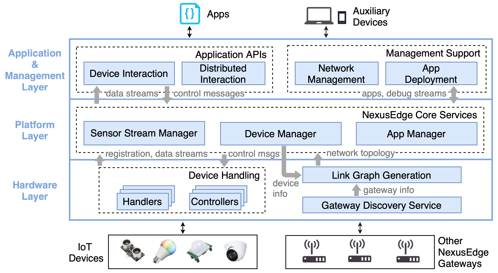
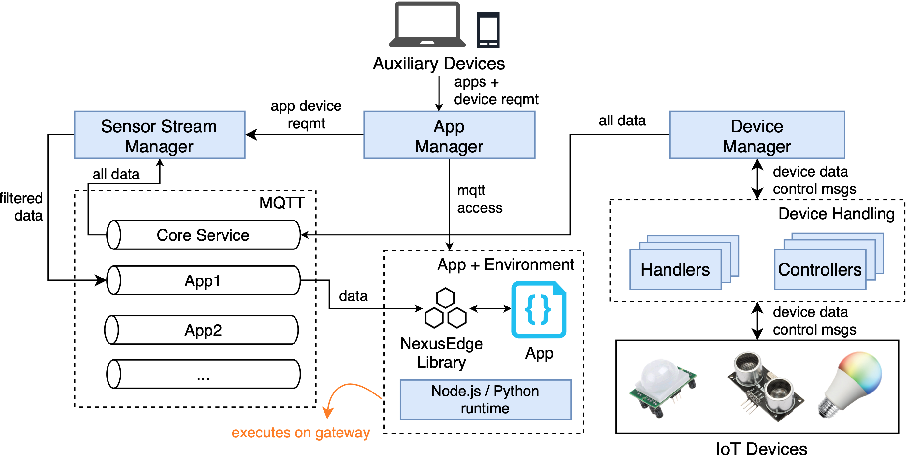

# NexusEdge
Middleware that runs on programmable IoT gateways (eg: RaspberryPi 4, Nvidia Jetson TX2) to create a decentralized Edge 
Computing platform. This work is described in more detail in 
[our paper](https://ieeexplore.ieee.org/abstract/document/9996626/) which was published at the ACM/IEEE Symposium on Edge 
Computing (SEC) 2022.

## Features

- **Gateway Discovery using BLE**: To minimize configuration overhead, 
gateways use their Bluetooth Low Energy (BLE) radio to discover each other. 
Gateways send and receive discovery messages as
BLE advertisements, using a pre-shared key (set in `utils/config.json`). 
The discovery messages contain the IP address of a
gateway's backhaul network (also defined in `utils/config.json`), and discovered 
gateways use this higher bandwidth network for further communication.
- **Link Graph Network Abstraction**: Since auto-discovery is the norm, knowledge 
about the current network topology is encapsulated in a link graph.
Each gateway hosts a web server (`platform/api-server`) which
exposes this information to other gateways via well-defined endpoints.
Link graph can be accessed here: 
```
http://<gateway-ip>:5000/platform/link-graph-visual # uses d3 to visualize the graph
http://<gateway-ip>:5000/platform/link-graph-data #in json
```  
- **Interfacing with Devices**: To support IoT device handling, NexusEdge
 supports two module types. *Controllers* 
 to communicate using a specific wired/wireless
technology, and *Handlers* the device-specific code to communicate with
devices. Each handler plugs into a specific controller. Because of a lack
of standardization, each device type needs a custom handler, and users
can load their custom controllers and handlers. The intent is a fixed number of
controllers per-gateway (one for each communication channel), and device
manufacturers can provide handlers for their devices.
- **Deploying and Scheduling Applications on the Platform**: Users can deploy applications
to the NexusEdge edge platform from auxiliary devices (user laptops) using the 
[hoos-nearby](https://github.com/uva-linklab/hoos-nearby) repo.
Deploying an application involves selecting the runtime environment and the 
necessary sensor streams. The application is sent to the App Manager on any NexusEdge gateway,
which selects the best gateway to execute the application.

## Implementation

The middleware runs four background services.

1. **Device Manager**:  Loads controllers and handlers, tracks registered devices, and
associates specific devices and device types with handlers. It receives data
streams from registered devices, and publishes them to a Core Service (nexusedge-data)
MQTT topic for other core services to use.
2. **Application Manager**: Accepts incoming requests to execute
applications. It tracks which applications are currently running, sets up their
execution environments, maintains log files, and processes termination requests.
3. **Sensor Stream Manager**: Ensures access control of device
data to applications. It branches data from the Core Service topic to different
applications based on their requirements. If data is unavailable at the
gateway, it requests other gateways to send data to the app.
4. **Data Publish Manager** (not shown in figure): Assists in publishing data to 
specified cloud endpoints. 

## Setup
The middleware requires Node.js v12.
* Install node.js v12.x
```
# Using Ubuntu
curl -sL https://deb.nodesource.com/setup_12.x | sudo -E bash -
sudo apt-get install -y nodejs

# Using Debian, as root
curl -sL https://deb.nodesource.com/setup_12.x | bash -
apt-get install -y nodejs
```
Reference: https://github.com/nodesource/distributions/blob/master/README.md
* Install other essential packages  
    apt install build-essential libudev-dev

* Add a config file named config.json in platform/utils/ which contains:  
(1) The network interface that the gateway uses for its backhaul network.  
*Note: Ensure that this interface uses IPv4*  
(2) The Group Key used to uniquely identify a NexusEdge gateway group.  
(3) The BLE advertisement service and characteristic UUIDs.

For e.g.:
```json
{
  "network": {
    "interface": "wlan0"
  },
  "groupKey": {
    "key": "95CFEF1B1F1F5FAAC6954BC1BD713081",
    "iv": "6F2E2CEE52C1AB42"
  },
  "bleAdvUuids": {
    "serviceUuid": "18338db15c5841cca00971c5fd792920",
    "charUuid": "18338db15c5841cca00971c5fd792921"
  }
}
```

* To install the packages required for the core services, 
run `npm install` in the `platform` directory.

* Optional: To access accessing mqtt streams over websocket for remote debug of applications, 
add this to /etc/mosquitto/mosquitto.conf:
```
listener 1883 0.0.0.0 

listener 9001 0.0.0.0
protocol websockets
```

## Adding Handlers
To support a new device type, you can add a new handler. Handlers have to be placed in 
`device-manager/handlers/<new-handler>`. A new entry has to be added to 
`device-manager/handlers/handlers.json`. 
The handler directory follows an npm package structure. Dependencies for the handler 
can be specified in a package.json file.

### Installing Dependencies for Handlers
Run `node platform/device-manager/handlers/install-handlers.js`. 

## Adding a Data Publisher
Instructions to add a data publisher are given 
[here](https://github.com/uva-linklab/nexusedge/tree/master/platform/data-publish-manager/publishers). 

## Running the Middleware
From the platform directory, `node platform-manager.js`.

## Running the Middleware as a Docker Container
To run with default configuration as shown above:
```
docker run --net=host -d nabeeln7/on-the-edge:latest
```

### Changing the Configuration of the Container
To override configuration, an environment file can be passed to the docker container:
```
docker run --net=host -d --env-file env.list nabeeln7/on-the-edge:latest
```

The environment file is of the following format:
```
NEXUSEDGE_GATEWAY_ID=dca632a232bd
NEXUSEDGE_BACKHAUL_INTERFACE=wlan0
NEXUSEDGE_GROUP_KEY=95CFEF1B1F1F5FAAC6954BC1BD713081
NEXUSEDGE_GROUP_IV=6F2E2CEE52C1AB42
NEXUSEDGE_BLE_ADV_SERVICE_UUID=28338db15c5841cca00971c5fd792920
NEXUSEDGE_BLE_ADV_CHAR_UUID=28338db15c5841cca00971c5fd792921
```
